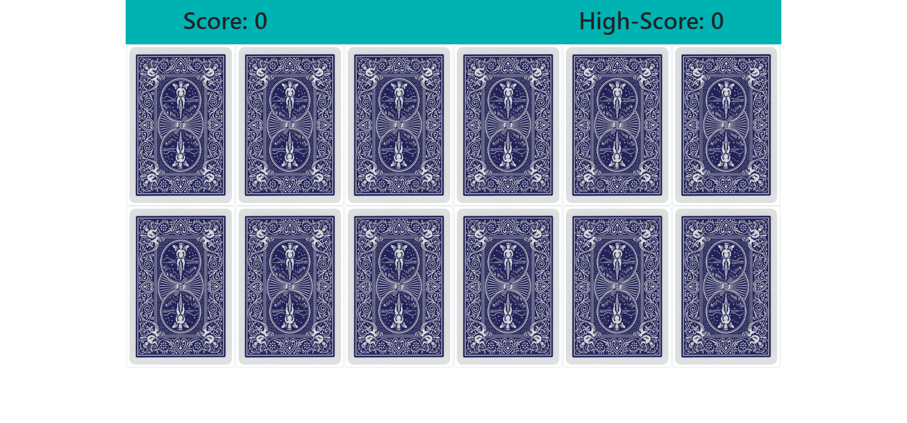
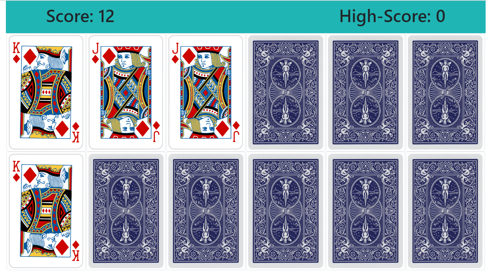

# Memory Game

## Purpose

This was made mostly for me to learn more about react and state in particular.

## Instructions

There are simple instructions in game, click done to dismiss that. Afterwards you click on a facedown card to turn it over, then click on another to try and match them. If they match they will stay face up, otherwise they will turn back over. Try to get them all face up in as few moves as possible.

## Images

## Author

Evan Jones

## Technologies Used

Made only using React

## Contact

evanjones@fastmail.net
